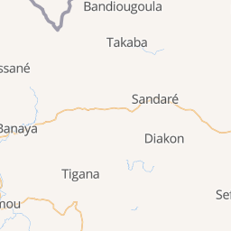
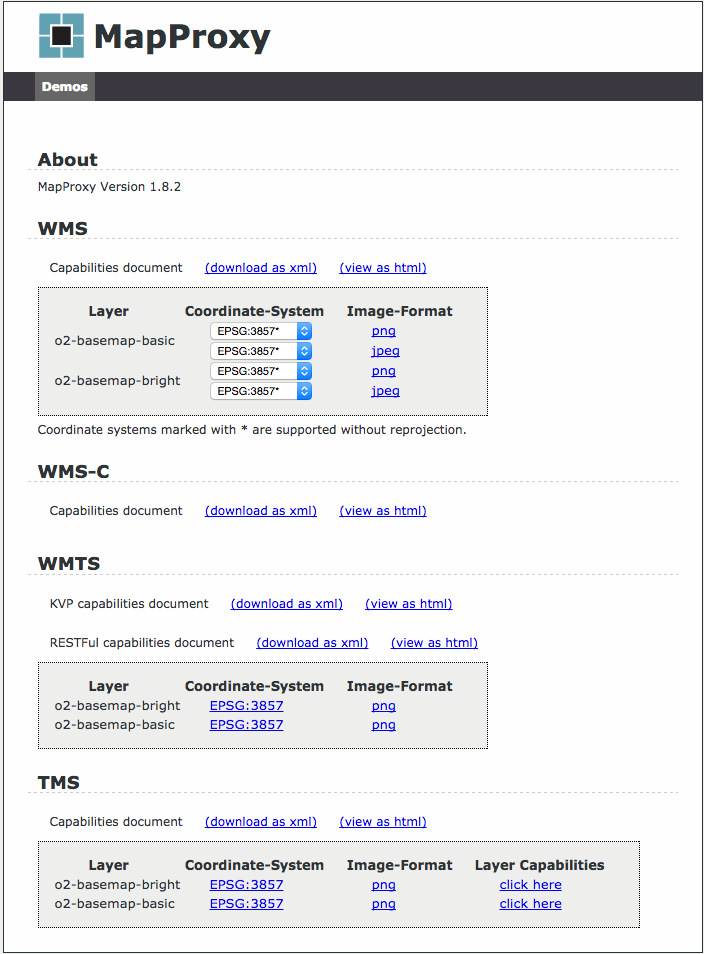

# OMAR Basemap


## Running omar-basemap locally
1. Clone the following repo: https://github.com/ossimlabs/omar-basemap/tree/master
2. Download the necessary plugins and put them in a folder
3. Add those plugins to a directory and make sure you add that directory to the build.gradle file
4. Do a gradlew buildDockerImage which should generate a Dockerfile in the docker directory
5. Do a docker build . in the directory of the Dockerfile
6. Download an mbtiles file. An example of a file to download us by doing the following command:curl -o zurich_switzerland.mbtiles https://openmaptiles.os.zhdk.cloud.switch.ch/v3.3/extracts/zurich_switzerland.mbtiles
7. You can run the tile server by either doing a) tileserver-gl zurich_switzerland.mbtiles or b) docker run -it -v /data -p 8080:80 klokantech/tileserver-gl

## Installation in Openshift

**Assumption:** The omar-basemap docker image is pushed into the OpenShift server's internal docker registry and available to the project.

1. Create a PersistentVolume with enough space for the appropriate 'mbtiles' file. This file serves as the basemap layer of the world. The highest resolution set can be upwards of 40gb.
2. Download the planet mbtiles file from here: https://openmaptiles.com/downloads/dataset/osm/#0.23/-0/0.
3. Copy the downloaded tile file onto the PersistentVolume created in step 1.
4. Create a PersistenVolumeClaim for the omar-basemap deployment
5. Deploy the omar-basemap image into the appropriate project. The associated pod will deploy using *port 80*
6. Attach the PersistenVolumeClaim created in step 3 to the deployment. Mount the claim to */data* in the basemap pod.

### Environment Variables
* No environment variables are required

### An Example DeploymentConfig

```yaml
apiVersion: v1
kind: DeploymentConfig
metadata:
  annotations:
    openshift.io/generated-by: OpenShiftNewApp
  creationTimestamp: null
  generation: 1
  labels:
    app: omar-openshift
  name: omar-basemap
spec:
  replicas: 1
  selector:
    app: omar-openshift
    deploymentconfig: omar-basemap
  strategy:
    activeDeadlineSeconds: 21600
    resources: {}
    rollingParams:
      intervalSeconds: 1
      maxSurge: 25%
      maxUnavailable: 25%
      timeoutSeconds: 600
      updatePeriodSeconds: 1
    type: Rolling
  template:
    metadata:
      annotations:
        openshift.io/generated-by: OpenShiftNewApp
      creationTimestamp: null
      labels:
        app: omar-openshift
        deploymentconfig: omar-basemap
    spec:
      containers:
      - image: 172.30.181.173:5000/o2/omar-basemap@sha256:0c353825fb23043b9a82674c07faff3ba3bf4e01b95d15f1ce6936b83ffbe98c
        imagePullPolicy: Always
        name: omar-basemap
        ports:
        - containerPort: 80
          protocol: TCP
        resources: {}
        terminationMessagePath: /dev/termination-log
        volumeMounts:
        - mountPath: /data
          name: volume-basemap
      dnsPolicy: ClusterFirst
      restartPolicy: Always
      securityContext: {}
      terminationGracePeriodSeconds: 30
      volumes:
      - name: volume-basemap
        persistentVolumeClaim:
          claimName: basemap-dev-pvc
  test: false
  triggers:
  - type: ConfigChange
  - imageChangeParams:
      automatic: true
      containerNames:
      - omar-basemap
      from:
        kind: ImageStreamTag
        name: omar-basemap:latest
        namespace: o2
    type: ImageChange
status:
  availableReplicas: 0
  latestVersion: 0
  observedGeneration: 0
  replicas: 0
  unavailableReplicas: 0
  updatedReplicas: 0
```

## Verification

This assumes that the omar-UI is deployed in openshift and is running.To verify that the basemap and mapproxy are working properly, open up the UI and go to the map search page.For example, go to https://omar-dev.ossim.io/omar-ui/omar#/map and make sure the basemap loads in the map.

## Troubleshooting

From openshift, if the basemap is not loading into the UI, the following steps would help you troubleshoot the issues.
1. You should see a webpage that has a title of TileServer GL.
2. You can also test the the TileServer by navigating to the route created in step 1.
A test image from the server will be returned that looks like:

3. To test the proxy you will need to copy/paste the following into the browser: http://mapproxy.omar-dev.ossim.io
You should see the following page if you click demo:

4. Make sure that the o2-basemap-basic and o2-basemap-bright layers show up.If they don't, make sure the mapproxy.yml is on the NFS server.If mapproxy.yml is loaded, make sure it is pointed to omar-base and is mounted correctly.
5. If the above steps aren't work, add a route to the mapproxy service pertinent to testing.Give it a name and make sure the service is "omar-basemap".You should see some Styles and Data sections if you click on the hyperlink. If you aren't seeing any of that, make sure omar-base is up and running.
6. At this point your are ready to use the basemap and proxy in a mapping application.The following HTML/Javascript code can be used to test the basemap stack:
```html
<!DOCTYPE html>
<html>
  <head>
    <title>o2 | Tile WMS</title>
    <link rel="stylesheet" href="https://openlayers.org/en/v3.19.1/css/ol.css" type="text/css">
    <!-- The line below is only needed for old environments like Internet Explorer and Android 4.x -->
    <script src="https://cdn.polyfill.io/v2/polyfill.min.js?features=requestAnimationFrame,Element.prototype.classList,URL"></script>
    <script src="https://openlayers.org/en/v3.19.1/build/ol.js"></script>
  </head>
  <body>
    <div class="zoomLevel"></div>
    <div id="map" class="map"></div>
    <script>
      var layers = [
        new ol.layer.Tile({
          source: new ol.source.TileWMS({
            url: 'http://localhost/o2-basemap-proxy/wms',
            params: {
              'VERSION': '1.1.1',
              'LAYERS': 'o2-basemap-bright',
            },
          })
        }),
      ];
      var map = new ol.Map({
        layers: layers,
        target: 'map',
        view: new ol.View({
          center: [0, 0],
          projection: 'EPSG:4326',
          //center: [-10997148, 4569099],
          zoom: 2
        })
      });


      map.on('moveend', function () {
        console.log('Zoom Level: ' + map.getView().getZoom());
        document.getElementsByClassName('zoomLevel')[0].innerHTML = 'Zoom Level: ' + map.getView().getZoom()
      });


    </script>
  </body>
</html>
```
